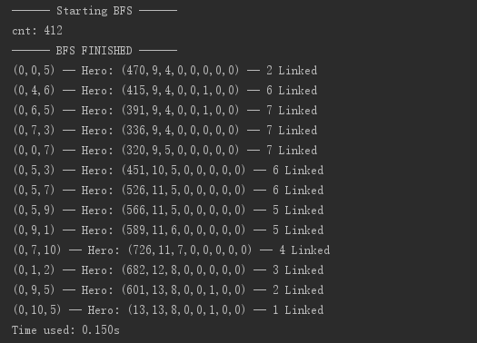
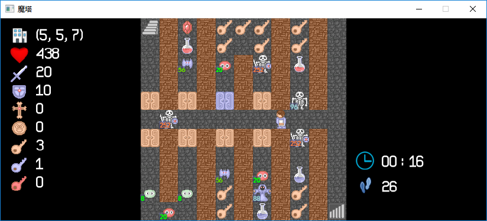
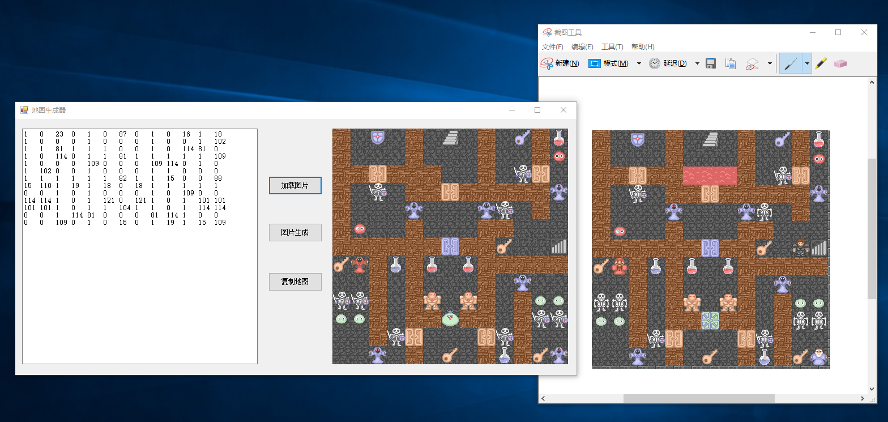

魔塔小游戏中的AI
================

魔塔，是一个策略类的固定数值的RPG小游戏，难度不低，对智商是一次艰巨的考验。

本项目可以对一个简单的塔进行计算，找寻最佳路线。

有关本项目的算法说明，可参见我的博客： <a href="http://ckcz123.com/blog/catagory/magic-tower-ai/" target="_blank">http://ckcz123.com/blog/catagory/magic-tower-ai/</a>。

本项目由三个子项目组成：
 * **AI** ： 真正的拆塔计算过程，Java编写。
 * **program** ： 一个可视化程序，可以读入地图数据并打出游戏，C++编写。
 * **map_generator** ： 地图生成器，可以根据图片生成地图文件，C#编写。

另外，还提供了若干已有的测试数据放在test目录下。

&nbsp;

## 地图数据说明

本项目采用的地图均为自定义地图。有关地图数据的说明可参见[这里](test/)。

将地图数据文件重命名为input.txt并放置在可视化程序目录下，即可打出地图并开始游戏。

将地图数据内容全部复制，并粘贴到AI项目的控制台下，即可进行路线的计算。

&nbsp;

## AI

此子项目是真正的拆塔计算过程，使用Java编写。

直接使用Java 8以上编译运行，然后在控制台粘贴地图数据内容即可。

有关算法的详细讨论，可参见我的博客： <a href="http://ckcz123.com/blog/catagory/magic-tower-ai/" target="_blank">http://ckcz123.com/blog/catagory/magic-tower-ai/</a>。

&nbsp;

## 可视化程序

此子项目是一个可视化程序，使用C++基于hge库编写。

可视化程序可以读取同目录下的input.txt地图数据文件，并将整个地图打出来，以方便进行游戏。

请使用VS2012及以上进行编译运行。  

如果使用VS2015进行编译，请将 `legacy_stdio_definitions.lib` 加入到项目库中，以免发生 `error LNK2019: unresolved external symbol _sscanf` 错误。

**请将hge文件夹下的所有`dll`文件，以及源代码目录下的`Res`文件夹，复制到生成文件夹中，才可以正常进行运行游戏。**   

&nbsp;

## 地图生成器

由于地图数据是我们自定义的，所以在真正将AI投入使用时需要手动录入每个位置的数据，十分不便；因此我做了这样一个地图生成器，可以读取一张给定的地图图片，打印出地图的数据内容。

此子项目使用C#进行编写。请使用VS2012及以上编译运行。

加载图片时，如果剪切板里存在图片将直接从剪切板里读取；否则将打开一个对话框以选择图片文件。

推荐使用方法：打开Windows自带的截图工具，使用矩形截图实际一座塔里的地图，然后将整个地图复制；再点击该地图生成器的“加载图片”，得到实际地图，最后手动修改不符合条件的数据，最后复制地图数据即可。

**警告：本程序会从左上角进行像素的匹配；因此请确保图片左上角刚好为地图的(0,0)，截图时需仔细选中最左上角位置，否则可能会输出完全不符合的结果。**

&nbsp;

## 意见反馈

欢迎star或fork这个项目，给我一些支持和鼓励；如果你也对魔塔AI比较感兴趣，有什么意见或建议，欢迎直接联系我。

你可以直接提出issues，也可以邮件至 `ckcz123@126.com`或`ckcz12345@gmail.com`。

感谢大家对本项目的支持！
